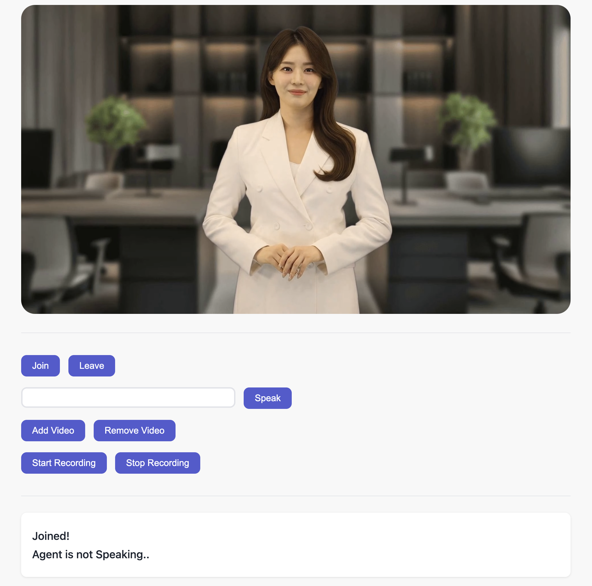

# Ejel Streaming Demo for Vanilla JS

이 프로젝트는 `ejel-streaming-js` 라이브러리를 사용한 기본적인 Vanilla Javascript 데모입니다.



## 기능

이 데모에서는 [Room](https://docs.ejelai.com/room)을 사용하여 다음과 같은 기능을 구현합니다.

- Ejel Streaming stream 참여/종료
- 에이전트와 텍스트 채팅으로 대화
- 에이전트 비디오 추가/제거
- 음성 녹음
- STT(Speech-to-Text)

각 기능에 대한 자세한 사항은 [Documentation](https://docs.ejelai.com)에서 확인하세요.

## 시작하기

### 사전 요구사항

- Ejel API Key (https://ejelai.com/api-key)
- npm 또는 yarn

### 설치

1. 저장소를 클론합니다

```bash
git clone https://github.com/VMONSTER-AI/ejel-streaming-js-vanilla-demo.git
cd ejel-streaming-js-vanilla-demo
```

2. 의존성 설치

```bash
npm install
# 또는
yarn install
```

3. 환경 변수 설정

```bash
VITE_API_KEY=YOUR_API_KEY  // Ejel API Key
VITE_AGENT_ID=YOUR_AGENT_ID  // Ejel Agent ID
VITE_SERVER_URL=YOUR_SERVER_URL  // 기본적으로 http://api.ejelai.com 를 사용하세요.
```

4. 애플리케이션 시작

```bash
npm run dev
# 또는
yarn run dev
```

이제 개발 서버가 localhost:3001에서 실행됩니다.
