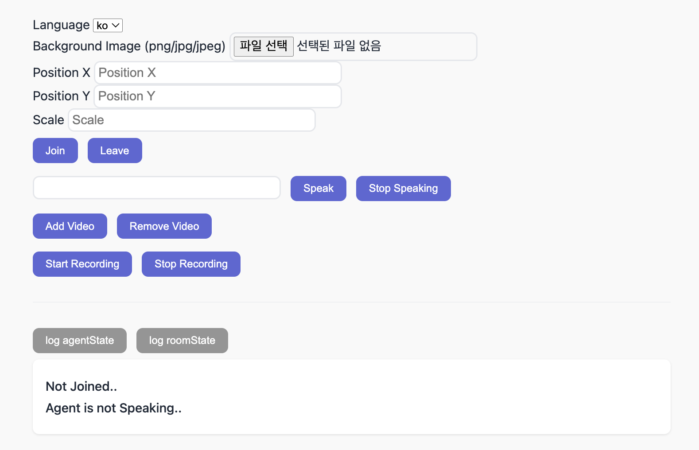
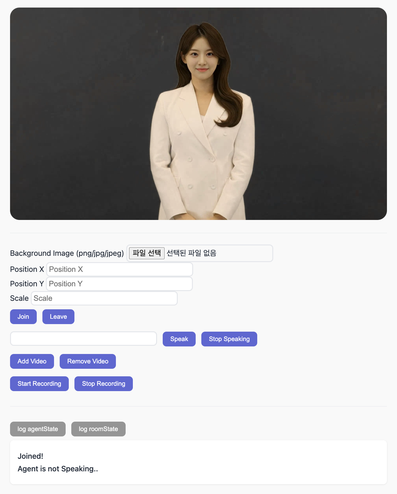

# Ejel Streaming Demo for Vanilla JS

This project is a basic Vanilla Javascript demo using the `ejel-streaming-js` library.




## Features

This demo implements the following features using ejelRoom:
[ejelRoom-KOR](https://docs.ejelai.com/undefined/real-time-streaming-sdk/ejelroom)
[ejelRoom-ENG](https://docs.ejelai.com/english/real-time-streaming-sdk/ejelroom)

- Join/Leave Ejel Streaming stream
- Request agent to speak text
- Stop agent speaking
- Add/Remove agent video
- Set background / position / scale

## Getting Started

### Prerequisites

- Your Ejel API Key (https://ejelai.com/api-key)
- npm or yarn

### Installation

#### 1. Clone the repository

```bash
git clone https://github.com/VMONSTER-AI/ejel-streaming-js-vanilla-demo.git
cd ejel-streaming-js-vanilla-demo
```

#### 2. Install dependencies

```bash
npm install
# or
yarn install
```

#### 3. Set environment variables

```bash
VITE_API_KEY=YOUR_API_KEY  // Your Ejel API Key
VITE_AGENT_ID=AGENT_ID  // Ejel Agent ID
VITE_SERVER_URL=SERVER_URL  // Use http://api.ejelai.com/v1 by default.
```

#### 4. Start the application

```bash
npm run dev
# or
yarn run dev
```

The development server will now run on localhost:3001.
